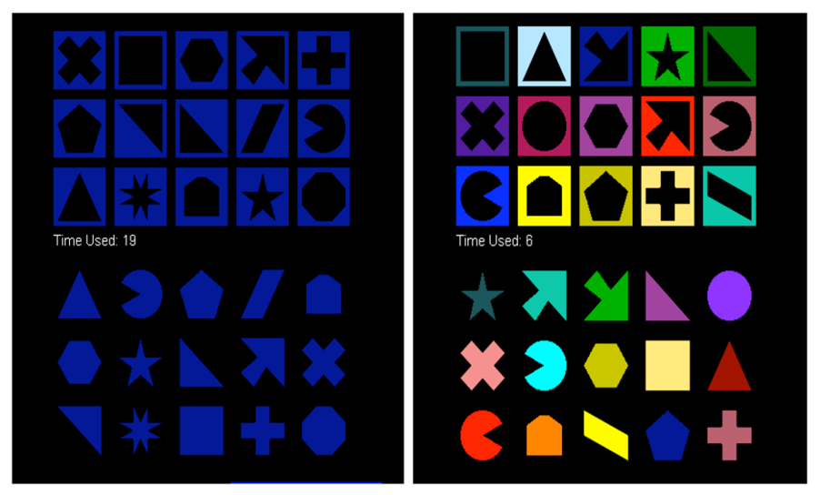

```{r setup, include=FALSE}
source('assets/setup.R')

# knitr::opts_chunk$set(cache = TRUE)
set.seed(1)
```

:::green
Be sure to check the [**solutions to last week's exercises**](03_slr_model_fit.html).<br>You can still ask any questions about previous weeks' materials if things aren't clear!
:::

:::lo
**LEARNING OBJECTIVES**

1. Understand the meaning of model coefficients in the case of a binary predictor.
1. Be able to state the assumptions underlying a linear model.
1. Understand how to assess if a fitted model satisfies the linear model assumptions.
1. Understand how to use transformations when the model violates assumptions.
:::


# Research question

*Do distracting colours influence game completion time?*

A group of students wanted to answer the above research question. To do so, they designed a standard computerized game and a second version with distracting colours. Time to completion and type of game played were recorded for each study participant. 
See the data description below for more information.

`r optbegin('Data: perfection.csv. Click the plus to expand &#8594;', FALSE, show = TRUE, toggle = params$TOGGLE)`
**Download link**

[Download the data here](https://uoepsy.github.io/data/perfection.csv)

**Description**

A group of students wanted to investigate the impact of colour distracters on game completion time.
They hypothesized a slower completion time for those playing a game with distracting colours, as a consequence of the widely known *Stroop effect* [@Stroop1935].

The students created two computer versions of the Perfection game.^[
Perfection is a popular game in which a person is expected to place an assortment of shaped pegs into the matching spaces.
]
In one version of the computerised game, the "standard" game type, all pegs and shapes would be of the same colour.
In the other version of the game, the "colour" game type, pegs and shapes did not have matching colours, hence there was a colour distracter effect.
The task was to click and drag each peg to the space with the matching shape.

They randomly recruited 40 students from the same university. Half were randomly assigned to the standard game and the other half to the colour distracter version.
All participants would play in similar conditions: same location and similar background noise to control for possible distractions.


```{r dc-perfection-image, echo=FALSE, out.width='60%', fig.cap='Electronic Perfection game with and without colour distracters. The instructions for the game were to click and drag each peg to the space with the matching shape.'}

```

The following variables were collected:

- `student_id`: Identifier for each student
- `type`: game type: Standard or Colour
- `time`: time (in seconds) from the start of the game to completion


**Preview**

The first six rows of the data, provided by @Kuiper2012, are:

```{r echo=FALSE}
library(tidyverse)
library(kableExtra)

perfection <- read_csv('https://uoepsy.github.io/data/perfection.csv')
kable(head(perfection), align='c') %>% kable_styling(full_width = FALSE)
```

`r optend()`


# Data exploration

`r qbegin(1)`
Read the Perfection game data into R and name the data frame `perfection`.

Check for the correct encoding of all variables --- that is, categorical variables should be factors and numeric variables should be numeric.
`r qend()`

`r solbegin(show = params$SHOW_SOLS, toggle = params$TOGGLE)`
```{r}
library(tidyverse)

perfection <- read_csv('https://uoepsy.github.io/data/perfection.csv')
head(perfection)
```

Game type is a categorical variable but is encoded as a character (`<chr>`) variable rather than a factor.
Let's fix it:
```{r}
perfection <- perfection %>%
  mutate(type = as.factor(type))

head(perfection)
```

`r solend()`


`r qbegin(2)`
Identify the units, the population to which conclusions can be generalised to, the explanatory variable and the response variable. Also classify the variables according to their type.

Is this study an experiment or an observational study?
`r qend()`

`r solbegin(show = params$SHOW_SOLS, toggle = params$TOGGLE)`
Units: each student.

Population: set of all students at this university who would be willing to be part of the study.

Explanatory variable: type of game (standard or with a colour distracter). Type: categorical.

Response variable: the completion time (in seconds). Type: numeric.

This study is an experiment, since students were randomly allocated to one of the two types of games.
`r solend()`


`r qbegin(3)`
Display and describe the marginal distribution of game type.
`r qend()`

`r solbegin(show = params$SHOW_SOLS, toggle = params$TOGGLE)`
Type of game played is a categorical variable. We visualise it, for example, with a bar plot:
```{r}
ggplot(perfection, aes(x = type)) +
  geom_bar()

perfection %>%
  group_by(type) %>%
  summarise(n = n())
```

:::int
The forty students were evenly split at random to take either the standard game or the one with distracting colours.
Each group consisted of 20 students.
:::
`r solend()`


`r qbegin(4)`
Display and describe the marginal distribution of completion times.
`r qend()`

`r solbegin(show = params$SHOW_SOLS, toggle = params$TOGGLE)`
```{r}
ggplot(perfection, aes(x = time)) +
  geom_density() +
  geom_boxplot(width = 1/100)

perfection %>%
  summarise(M = mean(time),
            SD = sd(time))
```

:::int
The distribution completion times appears to be unimodal, centred at approximately 37 seconds, with a SD of roughly 4 seconds.

The boxplot does not highlight any outliers.
:::
`r solend()`


`r qbegin(5)`
Display and describe the relationship between game type and completion times.

Does it look like the groups have equal mean or spread? Are there any extreme observations? 
`r qend()`

`r solbegin(show = params$SHOW_SOLS, toggle = params$TOGGLE)`
There are many correct way to investigate the distribution of completion times by group.

**Option 1: Boxplots by group**
```{r perfection-boxplots, fig.cap='Boxplots of competion times by game type.'}
ggplot(perfection, aes(x = type, y = time)) +
  geom_boxplot()
```

**Option 2: Dotplots by group**
```{r perfection-dotplots, fig.cap='Dotplots of competion times by game type.'}
ggplot(perfection, aes(x = type, y = time)) +
  geom_dotplot(binaxis = 'y')
```

or
```{r}
ggplot(perfection, aes(x = time )) +
  geom_dotplot() + 
  facet_grid(type ~ .)
```


**Option 3: Histograms by group**
```{r perfection-histograms, fig.cap='Histograms of competion times for each game type.'}
ggplot(perfection, aes(x = time)) +
  geom_histogram(binwidth = 1, color = 'white') +
  facet_grid(rows = vars(type))
```

**Option 4: Violin plots by group**

The following code creates two violin plots, one for each group, with the group means denoted by red points:
```{r perfection-violins, fig.cap='Histograms of competion times for each game type.'}
ggplot(perfection, aes(x = type, y = time)) +
  geom_violin() +
  stat_summary(fun = mean, color = 'red')
```

And many other options...


<br>
The summary statistics by group can be computed as follows:
```{r}
stats_time <- perfection %>%
  group_by(type) %>%
  summarise(n = n(),
            mean_time = mean(time), 
            sd_time = sd(time))

stats_time
```


The summary statistics of completion time by group are as follows:

| Group Type | Summary statistics |
|:-----------|:-------------------|
| Colour distracter | $n_{C} = 20$, $\bar y_C = 38.10$, $s_C = 3.65$ |
| Standard group    | $n_{S} = 20$, $\bar y_S = 35.55$, $s_S = 3.39$ |


For the write-up let's focus, for example, on Figures \@ref(fig:perfection-boxplots) and \@ref(fig:perfection-dotplots). We could write:

:::int
The distribution of game completion times is fairly symmetric and bell-shaped in both groups, as highlighted by the dotplots in Figure \@ref(fig:perfection-dotplots).
Furthermore, the spread (standard deviation) of the two distributions appears to be similar.

The boxplots in Figure \@ref(fig:perfection-boxplots) do not highlight any outliers. They suggest a higher mean completion time in the colour distracter group ($\bar y_C = 38.10$ s) than the standard group ($\bar y_S = 35.55$ s). The standard deviation of completion time in the colour distracter group ($s_C = 3.65$ s) is similar to that in the standard group ($s_S = 3.39$ s).
:::

`r solend()`


# Model specification and fitting

`r qbegin(6)`
The researchers hope to determine if distracting colours could impact response times when playing a computerised version of the Perfection game.

Using a two-sided alternative, write out in words and in symbols appropriate null and alternative hypothesis for the research question of interest.
`r qend()`

`r solbegin(show = params$SHOW_SOLS, toggle = params$TOGGLE)`
Let $\mu_C$ represent the true mean response time of the colour group and $\mu_S$ the true mean response time of the standard group.


- Null hypothesis: $H_0: \mu_C = \mu_S$ (the mean completion time for the colour distracter game is equal to the mean completion time for the standard game).

- Alternative hypothesis: $H_0: \mu_C \neq \mu_S$ (the mean completion time for the colour distracter game is not equal to the mean completion time for the standard game).


<br>
Equivalently, you could have specified:

- Null hypothesis: $H_0: \mu_C - \mu_S = 0$ (the difference in mean completion time between the colour distracter game and the standard game is zero).

- Alternative hypothesis: $H_0: \mu_C - \mu_S \neq 0$ (the difference in mean completion time between the colour distracter game and the standard game is different from zero).
`r solend()`


`r qbegin(7)`
Using the `t.test()` function, perform a statistical test against the null hypothesis specified above.
`r qend()`

`r solbegin(show = params$SHOW_SOLS, toggle = params$TOGGLE)`
First, we need to check if the two samples come from populations having the same variance:
```{r}
var.test(time ~ type, data = perfection)
```

:::int
We performed an F-test against the null of equal population variances ($F(19, 19) = 1.16, p = 0.75$, two-sided).

The sample results do not provide sufficient evidence to reject the null hypothesis of equal population variances.
:::

In light of the previous test results we will tell R to perform a pooled t-test by saying that the variances are equal with `var.equal = TRUE`:
```{r}
t_res <- t.test(time ~ type, data = perfection, var.equal = TRUE)
t_res
```

:::int
We performed a two-sample t-test against the null hypothesis of equal mean time to complete the colour distracter game and standard game.

At the 5\% significance level, the observed difference in mean completion times between the colour distracter and standard game is significantly different from 0 ($t(38) = 2.29$, $p = 0.028$, two-sided).

The sample data provide strong evidence that, on average, the time taken to complete the game with distracting colours is different from the standard game. 
As the t-statistic is positive (2.29), we can also say that the colour distracter game had a significantly higher average completion time than the standard game.
:::

To comment on the magnitude of this observed difference in the population means we must resort to the confidence interval: $[0.29, 4.81]$.

:::int
We are 95% confident that participants playing the colour distracter game take between 0.29 and 4.81 seconds longer to complete the game, on average, than those playing the standard game.
:::
`r solend()`


`r qbegin(8)`
Using the linear model function, `lm()`, fit the following linear model to the Perfection game data:
$$
Time = \beta_0 + \beta_1 \ Type + \epsilon
$$

Write down the equation of the fitted line.
`r qend()`

`r solbegin(show = params$SHOW_SOLS, toggle = params$TOGGLE)`
```{r}
mdl_perf <- lm(time ~ 1 + type, data = perfection)
summary(mdl_perf)
```

The fitted model is:
$$
\widehat{Time} = 38.1 - 2.55 \ Type
$$
`r solend()`


`r qbegin(9)`
At the 5\% significance level, are the regression coefficients significantly different from zero?

Does the model explain a significant fraction of the variability in completion times?
`r qend()`

`r solbegin(show = params$SHOW_SOLS, toggle = params$TOGGLE)`
At the 5\% significance level, both the intercept ($t(38) = 48.31, p < .001$, two-sided) and the slope ($t(38) = -2.29, p = 0.028$, two-sided) are significantly different from zero.

The F-statistic for model utility, in the case of simple linear regression, is simply the square t-statistic for the slope.
The model involving game type as a predictor explains a significant amount of the variability in the response ($F(1,38) = 5.23, p = 0.028$). 
That is, type of game played is a significant predictor of game completion time.
`r solend()`


`r qbegin(10)`
Do you notice any similarities between the results of the two-sample t-test (performed via `t.test()`) and those of the linear model fitted via `lm()`?
`r qend()`

`r solbegin(show = params$SHOW_SOLS, toggle = params$TOGGLE)`
Consider the again the `t.test()` output and the `lm()` output:
```{r}
t_res
summary(mdl_perf)
```

In the t-test, `mean in group Colour` = 38.10 corresponds to the estimated intercept of the linear model, $\hat \beta_0 = 38.10$. That is, $$\bar y_C = \hat \beta_0$$

In the t-test, `mean in group Standard` = 35.55 corresponds to the estimated intercept plus slope in the linear model:
$$
\begin{matrix}
35.55 &=& 38.10 &+& (-2.55) \\
\bar y_S &=& \hat \beta_0 &+& \hat \beta_1 \\
\bar y_S &=& \bar y_C &+& (\bar y_S - \bar y_C)
\end{matrix}
$$

This means that, in the fitted model $\hat y = \hat \beta_0 + \hat \beta_1 x$, the predictor $x = 1$ denotes the standard group and $x = 0$ denotes the colour distracter group:
$$
\begin{aligned}
x = 0: \qquad &\hat y = \hat \beta_0 + \hat \beta_1 \times 0 = \hat \beta_0\\
x = 1: \qquad &\hat y = \hat \beta_0 + \hat \beta_1 \times 1 = \hat \beta_0 + \hat \beta_1 
\end{aligned}
$$

:::yellow
When dealing with a factor, R selects **the first level in alphabetical order** to be the **reference level** and $\hat \beta_0$ predicts the group mean of the reference level.

To do so, R internally denotes the two groups by a binary indicator variable $x$. It can take only two possible values: zero or one. When $x=0$, we are dealing with the reference group, while when $x = 1$ we are dealing with the other group.

The estimated slope $\hat \beta_1$ represents the predicted difference in means between the other group and the reference group.

Hence, testing if $\mu_S - \mu_C = 0$ is equivalent to testing if $\beta_1 = 0$.
:::

The `t-test` statistic, and the `lm()` t-statistic are equivalent in absolute value.
The p-value is identical.
Furthermore, the `lm()` F-statistic, 5.227, is the square of t-statistic, and the p-value is also identical.
`r solend()`


`r qbegin(11)`
Interpret the intercept and slope of the fitted regression model.
`r qend()`

`r solbegin(show = params$SHOW_SOLS, toggle = params$TOGGLE)`
Intercept

:::int
The estimated average completion time for those playing the colour distracter game is 38.10 seconds.
:::

Slope

:::int
The estimated difference in average completion times between those playing the standard game and the colour distracter one is -2.55 seconds. As the difference is negative, the colour distracter game has a higher estimated average completion time.

Equivalently, those playing the standard game will take on average 2.55 seconds less than those playing the colour distracter game.
:::
`r solend()`


# Assumptions check

The test statistics reported in the model results are based on a series of assumptions. If these assumptions are not satisfied, the results will not hold.

You can remember the four assumptions by memorising the acronym LINE:

- L - Linearity
- I - Independence
- N - Normality
- E - Equal variance

If at least one of these assumptions does not hold, say N - Normality, you might be reporting a LIE.


`r qbegin(12)`
Check if the fitted model satisfies the linearity assumption.

_**Hint:** An equivalent way to assess this is to check that the errors have a mean of zero. That is, there is no pattern left in the residuals as the systematic trend has entirely been captured by the linear model._
`r qend()`

`r solbegin(show = params$SHOW_SOLS, toggle = params$TOGGLE)`
As usual, there are multiple equivalent ways to check this. Below are a couple of possibilities.

Some useful quantities:
```{r}
perfection_check <- perfection %>%
  mutate(
    time_hat = predict(mdl_perf),
    resid = time - time_hat,
  )
```


Residuals vs fitted values:
```{r}
plot(mdl_perf, 1)
```

or:
```{r}
ggplot(perfection_check, aes(x = time_hat, group = type, y = resid)) +
  geom_point(alpha = 0.5)
```


Residuals vs explanatory variable:
```{r}
ggplot(perfection_check, aes(x = type, y = resid)) +
  geom_point(alpha = 0.5)
```


Boxplot of residuals vs fitted values:
```{r}
ggplot(perfection_check, aes(x = time_hat, group = type, y = resid)) +
  geom_boxplot()
```

Boxplot of residuals vs explanatory variables:
```{r}

ggplot(perfection_check, aes(x = type, y = resid)) +
  geom_boxplot()
```

<br>
Any of the above plots can be used to say:

:::int
The residuals appear to be randomly scattered around zero in both groups, without showing any pattern with respect to the fitted values. Hence, there is no sign of violation of the zero-mean assumption.
:::
`r solend()`


`r qbegin(13)`
Check if the fitted model satisfies the independent errors assumption.
`r qend()`

`r solbegin(show = params$SHOW_SOLS, toggle = params$TOGGLE)`
A plot of the residuals against the fitted values should not show any patterns or clumps. The values should appear as being randomly scattered.

If there was a clear pattern, for example many consecutive points going upwards or downwards, we might have dependence of one observation from the previous ones.
In the case of a categorical predictor, we do not want one group systematically lower or higher than the other.

Let's inspect the plot created in the previous question:
```{r}
plot(mdl_perf, which = 1)
```

We might say:

:::int
The diagnostic plots of the residuals against the fitted values does not highlight any sign of violation of the independence of errors assumption.

The residuals appear to be randomly scattered with no clumps or patterns.
:::

`r optbegin('Observations over time. Click the plus to expand &#8594;', FALSE, show = TRUE, toggle = params$TOGGLE)`
The most common violation of this assumption happens when we have data collected over time.

In this case a plot of the residuals against time should show no pattern, otherwise we would be in the presence of correlated errors.
That is, knowing the value at time $t$ will let you predict the value at time $t+1$.

```{r}
ggplot(perfection_check, aes(x = seq_along(resid), y = resid)) +
  geom_line() +
  geom_point() +
  labs(x = 'Index', y = 'Residuals')
```

Where the function `seq_along()` returns, for each element its index:
```{r}
y <- c(10, 6, 12, 5)
seq_along(y)
```

The plot above does not highlight any signs of correlations among the residuals.

<br>
Another possible check is to plot the residuals against those same residuals but offset by one time position.

Depending on the data, violation of this assumption might need more advanced tools that not covered in this course.

<br>
We can also test for autocorrelation using the Durbin-Watson test from the `car` library:
```{r}
library(car)
durbinWatsonTest(mdl_perf)
```

:::int
We performed a Durbin-Watson test against the null hypothesis of no correlation ($DQ = 1.80$, $p = 0.522$, two-sided). 
The sample results do not provide sufficient evidence to reject the null hypothesis of no autocorrelation
:::
`r optend()`
`r solend()`


`r qbegin(14)`
Check if the fitted model satisfies the normality of the errors assumption.
`r qend()`

`r solbegin(show = params$SHOW_SOLS, toggle = params$TOGGLE)`
Let's create a histogram of the residuals, using 15 breaks of the x-axis:
```{r}
hist(residuals(mdl_perf), breaks = 15)
```

Note that the distribution of the residuals has zero mean. We don't see any significant departure from normality by inspecting the histogram. However, it is difficult to judge normality from histograms with so few observations.

Normal quantile plots are a more informative technique for assessing normality. Departures from a linear trend in such plots indicate a lack of normality.
```{r}
plot(mdl_perf, which = 2)
```
The plot above does not highlight any substantial departure from normality.

A more formal test for normality is the Shapiro-Wilk test against the null hypothesis that the sample comes from a normal distribution:
```{r}
shapiro.test(residuals(mdl_perf))
```

We could write up the results as follows, 

:::int
The distribution of the residuals appears reasonably symmetric and bell-shaped. The normal quantile plot follows a linear pattern and does not highlight any substantial skew or departure from normality.

Furthermore, we performed a Shapiro-Wilks test against the null hypothesis that the residuals come from a normal population. 
The test-statistic $W = 0.99$ leads to a p-value of 0.97. The large p-value means that we do not have sufficient evidence to reject the null hypothesis that the residuals came from a normal population.
:::

`r solend()`


`r qbegin(15)`
Check if the fitted model satisfies the equal variance assumption.
`r qend()`

`r solbegin(show = params$SHOW_SOLS, toggle = params$TOGGLE)`
The vertical spread of the residuals should roughly be the same everywhere.

We can visually assess it by plotting the Pearson residuals against the fitted values:
```{r}
residualPlot(mdl_perf)
```


As the residuals can be positive or negative, we can make it easier to assess equal spread by improving the "resolution" of the points.
We can make all residuals positive by discarding the sign (take the absolute value), and then take the square root to make them closer to each other.
A plot of $\sqrt{|\text{Standardized residuals}|}$ against the fitted values is shown below:
```{r}
plot(mdl_perf, which = 3)
```
The plot above has the points much closer to each other, and all above 0. The spread of the two groups appears pretty similar, and the line connecting the two point clouds seems to be flat (as it should be if the spread was constant).


We can also resort to a more formal statistical test against the null hypothesis of equal variance (homoscedasticity). 
The Breusch-Pagan test is implemented via the `ncvTest` (non constant variance) function from the `car` package:
```{r}
ncvTest(mdl_perf)
```

:::int
The spread of the standardized residuals appears to be constant as the fitted values vary.

We performed a Breusch-Pagan test against the null hypothesis of constant variance ($\chi^2(1) = 0.11, p = 0.74$).
At the 5\% significance level, the large p-value (0.74) indicates that the sample results do not provide sufficient evidence to reject the null hypothesis that the errors have constant variance.
:::

`r solend()`

# References

<div class="tocify-extend-page" data-unique="tocify-extend-page" style="height: 0;"></div>