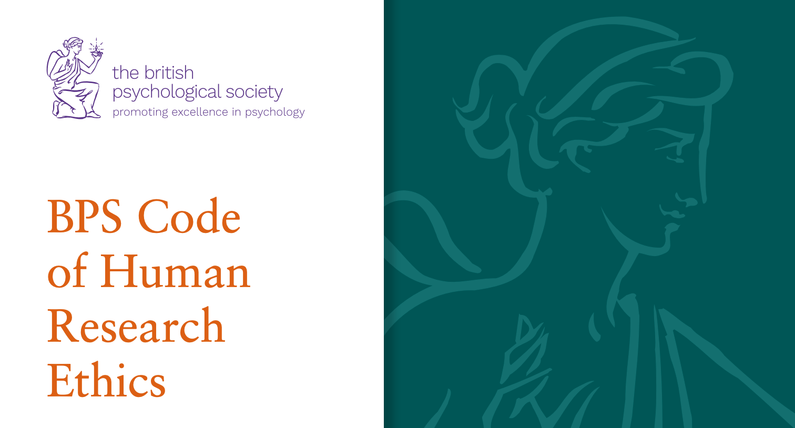

```{r setup, include=FALSE}
options(htmltools.dir.version = FALSE)
options(digits=4,scipen=2)
options(knitr.table.format="html")
xaringanExtra::use_xaringan_extra(c("tile_view","animate_css","tachyons"))
xaringanExtra::use_tile_view()
xaringanExtra::use_extra_styles(
  mute_unhighlighted_code = FALSE
)
xaringanExtra::use_share_again()
library(knitr)
library(tidyverse)
library(ggplot2)
library(kableExtra)
library(patchwork)
knitr::opts_chunk$set(
  dev = "png",
  warning = FALSE,
  message = FALSE,
  cache = FALSE
)
themedapr3 = function(){
  theme_minimal() + 
    theme(text = element_text(size=20))
}
#source("jk_source/jk_presfuncs.R")
```

```{r xaringan-themer, include = FALSE}
library(xaringanthemer)
style_mono_accent(
  # base_color = "#0F4C81", # DAPR1
  # base_color = "#BF1932", # DAPR2
  base_color = "#88B04B", # DAPR3 
  # base_color = "#FCBB06", # USMR
  # base_color = "#a41ae4", # MSMR
  header_color = "#000000",
  header_font_google = google_font("Source Sans Pro"),
  header_font_weight = 400,
  text_font_google = google_font("Source Sans Pro", "400", "400i", "600", "600i"),
  code_font_google = google_font("Source Code Pro"),
  code_font_size = "0.7rem",
  extra_css = list(".scroll-output" = list("height"="90%","overflow-y"="scroll"))
)
```

# Plan for this mini-course

### **Learning to do psychology**

- The principles behind ethical research

- The laws behind ethical research

- How to apply for ethical review


---

# Why do we bother with ethical review?

.pull-left[
- 1930s: Nazi Germany and Imperial Japan conduct abominable experiments on prisoners.

- 1930s: USA begins Tuskegee Syphilis Study.

- 1950s: Milgram conducts obedience to authority study.

- 2000s: Numerous high-profile psychologists (Marc Hauser, Diederick Stapel) accused of publishing falsified data.

- 2010s: British consulting firm Cambridge Analytica harvests personal data from millions of Facebook users.
]

.pull-right[

]

---
class: left, top

# Principles-based research ethics
.pull-left[


** British Psychological Society **

- Respect for the autonomy and dignity of persons

- Social responsibility 

- Maximising benefit and minimising harm

- Scientific value
]
.pull-right[


** American Psychological Association **

- Respect for persons and autonomy

- Justice

- Trust

- Beneficience and nonmaleficience

- Fidelity and Scientific Integrity

]

---
class: left, top
# Respect for persons

### What does it mean to conduct research based on respect for individuals?

- If a doctor were to ask you to take part in a medical study, what would you want to know ahead of time?

<br> 

### A key marker of respect for persons is *informed consent*

- Full disclosure of all information, including risk and benefits

- Listing of the obligations and responsibilities of both parties


---
class: left, top
# Potential concerns about fully informed consent


.pull-left[
** Confusion **

.center[]

- Understandable information sheets

]
.pull-right[

** Comprehension **

.center[]

- Distinguish consent from assent

]


---
class: left, top
# Social responsibility

.pull-left[
### Justice 

Ethically assigning the burdens as well as the benefits of research.

- Imagine: *A study to train working memory in children...*

- How do you ethically assign children to Test and Control groups?
]


---
class: left, top
# Social responsibility

.pull-left[
### Justice 

Ethically assigning the burdens as well as the benefits of research.

- Imagine: *A study to train working memory in children...*

- How do you ethically assign children to Test and Control groups?
]

.pull-right[
### Trust

Ensuring your participants' participation and data are protected.

- For example, keeping data *Confidential* versus *Anonymous*

- *Confidential data.* Identity of the participant is stored by the researcher, but cannot be accessed by others.

- *Anonymous data.* Identity of the participant is not even known by researcher.

]

---
class: left, top
# Maximising benefit and minimising harm

### Do good, and do no harm 

- The goal of minimising harm is why *deception* is typically frowned upon, and must be accompanied by a debrief.

---
class: left, top
# Fidelity and scientific integrity

Psychological science is a ** community ** exercise: Your participants, your collaborators, your readers and your peers.

Research misconduct harms all of these individuals.


---
class: inverse, center, middle

# Next time:
# General Data Protection Regulations


