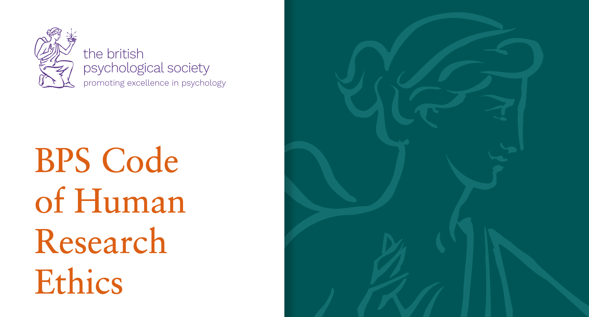
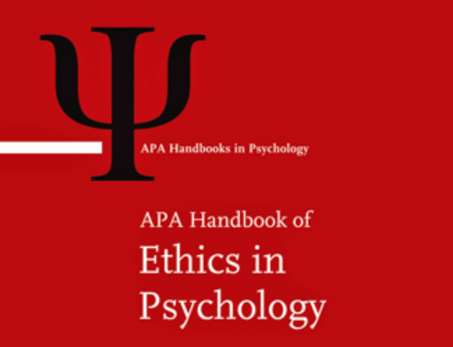

```{r setup, include=FALSE}
options(htmltools.dir.version = FALSE)
options(digits=4,scipen=2)
options(knitr.table.format="html")
xaringanExtra::use_xaringan_extra(c("tile_view","animate_css","tachyons"))
xaringanExtra::use_tile_view()
xaringanExtra::use_extra_styles(
  mute_unhighlighted_code = FALSE
)
xaringanExtra::use_share_again()
library(knitr)
library(tidyverse)
library(ggplot2)
library(kableExtra)
library(patchwork)
knitr::opts_chunk$set(
  dev = "png",
  warning = FALSE,
  message = FALSE,
  cache = FALSE
)
themedapr3 = function(){
  theme_minimal() + 
    theme(text = element_text(size=20))
}
#source("jk_source/jk_presfuncs.R")
```

```{r xaringan-themer, include = FALSE}
library(xaringanthemer)
style_mono_accent(
  # base_color = "#0F4C81", # DAPR1
  # base_color = "#BF1932", # DAPR2
  base_color = "#88B04B", # DAPR3 
  # base_color = "#FCBB06", # USMR
  # base_color = "#a41ae4", # MSMR
  header_color = "#000000",
  header_font_google = google_font("Source Sans Pro"),
  header_font_weight = 400,
  text_font_google = google_font("Source Sans Pro", "400", "400i", "600", "600i"),
  code_font_google = google_font("Source Code Pro"),
  code_font_size = "0.7rem",
  extra_css = list(".scroll-output" = list("height"="90%","overflow-y"="scroll"))
)
```


class: left, top

# Principles-based research ethics
.pull-left[


** British Psychological Society **

- Respect for the autonomy and dignity of persons

- Social responsibility 

- Maximising benefit and minimising harm

- Scientific value
]
.pull-right[



** American Psychological Association **

- Respect for persons and autonomy

- Justice

- Trust

- Beneficience and nonmaleficience

- Fidelity and Scientific Integrity

]


---
class: inverse, center, middle

# Managing your data under the General Data Protection Regulations

---
class: left, top

# What is GDPR?

## General Data Protection Regulations

- A set of EU regulations on how individuals and organizations collect and process concerning people.
- World's strictest privacy standards.

- Post-Brexit, subsumed into UK law as the Data Protection Act 2018.
- If an organization wants to work with an EU partner, it must follow GDPR.


---
class: left, top
# Different types of data under GDPR

### **Data**

- Any information collected about or from an individual (e.g., a response time).

### **Personal Data**

- Information about an individual that allows them to be identified (e.g., a name).

### **Sensitive Personal Data**

- Information about an individual that identifies certain protected characteristics, such as:
    + Race & ethnicity
    + Political opinions
    + Physical or mental health
    + and more...
    
    
---
class: left, top
# Why are data types important?

### **Collecting different types of data requires different levels of justification**

- Providing personal data could risk the privacy of your participant.
    + But as a *reseacher* you have a legal justification to collect that data, and become its **controller**.

<br>

- Providing sensitive personal data could put your participants at *risk*.
    + Thus, you must have a significant research justification for collecting that data.
    
<br>    
**Key implication:** Only collect the data that you really need, and ensure that that data is kept securely.


---
class: left, top
# What does it mean to keep data secure?

**Stored in a GDPR-approved location**
- For physical data: A locked filing cabinet in a locked room in your supervisor's laboratory.
- For electronic data: Your University OneDrive account, or within a password-protected Microsoft Teams group with your supervisor and collaborators.
    + *Not* in your personal dropbox or Google accounts.
    
**Locked with protective passwords**
- Never leave personal data open. Make sure your laptop has a password. Don't bring printouts to a cafe.

**Make data non-personal**
- *Anonymize* your data by removing identifying information. Anonymized data can be safely shared.
- Remember, identifying information can be subtle, like a University s-number.

---
class: left, top
# Data subject rights

Personal data that you collect is not strictly *yours.* It belongs to the subject collected from, and they have certain rights.

- **Right to be forgotten.** Subjects can request their data be erased.
- **Right to object.** Subjects can object to how their data is used.
- **Right to restrict processing.** Subjects can stop you processing their data.

And more, see [university data policy](https://www.ed.ac.uk/data-protection/data-subject-rights)

---
class: left, top
# Practical implications

### **1. Plan for your data. **
Consider what data, personal data, and sensitive personal data you need to collect. You will need to justify this when you apply for ethical approval in a Data Protection Impact Assessment (DPIA).

### **2. Design your consent form right**
The PPLS ethics portal contains example consent forms that will help you appropriately tell participants what data you will collect, and how they can contact you.

### **3. Plan for data storage**
Remember that you need secure and flexible storage, that will allow you to safely secure sensitive data, and process it when needed.
