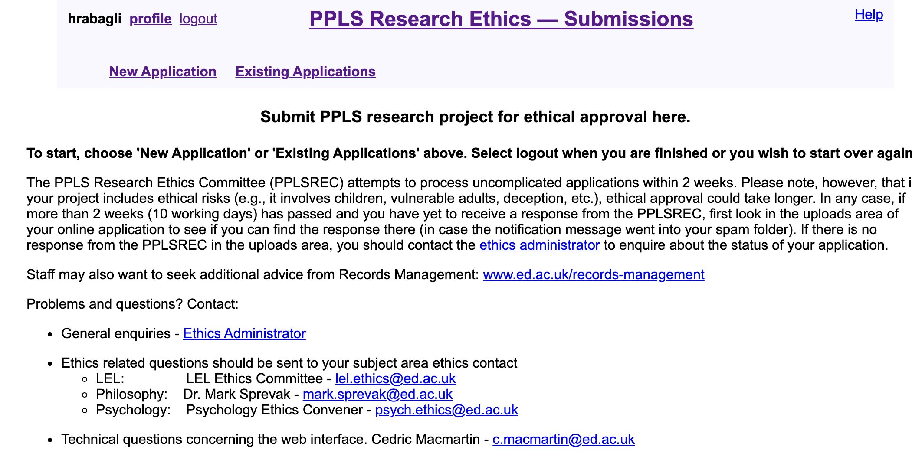

```{r setup, include=FALSE}
options(htmltools.dir.version = FALSE)
options(digits=4,scipen=2)
options(knitr.table.format="html")
xaringanExtra::use_xaringan_extra(c("tile_view","animate_css","tachyons"))
xaringanExtra::use_tile_view()
xaringanExtra::use_extra_styles(
  mute_unhighlighted_code = FALSE
)
xaringanExtra::use_share_again()
library(knitr)
library(tidyverse)
library(ggplot2)
library(kableExtra)
library(patchwork)
knitr::opts_chunk$set(
  dev = "png",
  warning = FALSE,
  message = FALSE,
  cache = FALSE
)
themedapr3 = function(){
  theme_minimal() + 
    theme(text = element_text(size=20))
}
#source("jk_source/jk_presfuncs.R")
```

```{r xaringan-themer, include = FALSE}
library(xaringanthemer)
style_mono_accent(
  # base_color = "#0F4C81", # DAPR1
  # base_color = "#BF1932", # DAPR2
  base_color = "#88B04B", # DAPR3 
  # base_color = "#FCBB06", # USMR
  # base_color = "#a41ae4", # MSMR
  header_color = "#000000",
  header_font_google = google_font("Source Sans Pro"),
  header_font_weight = 400,
  text_font_google = google_font("Source Sans Pro", "400", "400i", "600", "600i"),
  code_font_google = google_font("Source Code Pro"),
  code_font_size = "0.7rem",
  extra_css = list(".scroll-output" = list("height"="90%","overflow-y"="scroll"))
)
```


class: left, top
# How is research reviewed?



- Review panel of local psychologists with diverse expertise.
- Oversight by University ethics panel

---
class: left, top
# Types of review

### **Not all research requires a full ethical review.**

- e.g., No review needed for reanalysis of publicly available, unidentified data.

### **Most human subjects research does require review.**

- Review by one panel member if not collecting sensitive data.
- Review by two panel members if collecting data from children, or collecting sensitive personal data.
- Review by Head of Department if collecting dangerous data, or (as of August 2021) in-person data.

---
class: left, top
# What do I need to do for an ethics review.

### **1. Familiarise yourself with the PPLS Research Ethics Materials**

[https://www.ed.ac.uk/ppls/psychology/current/postgraduate/research-ethics](https://www.ed.ac.uk/ppls/psychology/current/postgraduate/research-ethics)

### **2. With your supervisor, begin an ethics application on the PPLS portal.**
[https://resource.ppls.ed.ac.uk/ethics/]()

### **3. Craft your information sheet, consent forms, and any advertisements you want to publicise. **

---
class: inverse, center, middle

Next: How to craft an ethics application.

